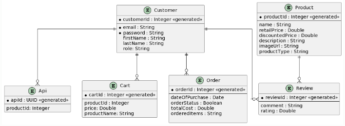

# E-Commerce-R-Us

GROUP C: PROJECT
ECommerce application for Revature final project

## Entity Relationship Diagram

## API Documentation

### API

#### View Apis

`GET /customer/view-apis`
- Cookie with authenticated JWT token is required

```shell
curl --location 'http://localhost:8080/customer/view-apis' \
--header 'Cookie: jwt=jwtToken'
```
- Response body
```json
[
    {
        "apiId": "79b9e2dd-b266-4447-b31d-f2c0932907f4",
        "productId": 1
    },
    {
        "apiId": "7ae40eb8-dff2-4d90-ab08-72be04145d5a",
        "productId": 1
    }
]
```

#### Delete Api

`DELETE /customer/delete-api`
- Cookie with authenticated JWT token is required
- Request body must provide `apiId`

```shell
curl --location --request DELETE 'http://localhost:8080/customer/delete-api' \
--header 'Content-Type: application/json' \
--header 'Cookie: jwt=jwtToken' \
--data '{
    "apiId" : "actual-api-key"
}'
```
- Response body
```json
{
    "apiId": "79b9e2dd-b266-4447-b31d-f2c0932907f4",
    "productId": 1
}
```

### Authentication

#### Sign up

`POST /auth/customer/sign-up`

- All the fields are required
- Duplicate emails are not allowed

```shell
curl --location 'http://localhost:8080/auth/customer/sign-up' \
--header 'Content-Type: application/json' \
--data-raw '{
    "firstName": "test",
    "lastName": "test",
    "email": "test@gmail.com",
    "password": "test"
}'
```

- Response body
- Response body will include all the details of the newly created customer together with its id
- Upon successful sign-up, the response will also provide the unique JWT token

```json
{
    "customerId": 2,
    "firstName": "test",
    "lastName": "test",
    "email": "test@gmail.com"
}
```

#### Sign in

`POST /auth/customer/sign-in`

- All fields are required
- Upon successful sign-in, the response will provide the unique JWT token

```shell
curl --location 'http://localhost:8080/auth/customer/sign-in' \
--header 'Content-Type: application/json' \
--data-raw '{
	"email": "test@gmail.com",
	"password": "test"
}'
```

- Response body
```json
{
    "customerId": 2,
    "firstName": "test",
    "lastName": "test",
    "email": "test@gmail.com"
}
```
- Sign out

```shell
curl --location --request POST 'http://localhost:8080/auth/customer/logout' \
```

### Cart

#### Add Item to Cart

- Cookie with authenticated JWT token is required
- Request body must provide `productId` and `price`

```shell
curl --location 'http://localhost:8080/customers/cart/add-to-cart' \
--header 'Content-Type: application/json' \
--header 'Cookie: jwt=jwtToken' \
--data '{
    "productId":2,
    "price":103.0
}'
```

- Response body
```json
{
    "cartId": 1,
    "productId": 2,
    "price": 103.0,
    "productName": "Prequalification Of One"
}
```

#### View Cart

`GET /customers/cart/view-cart`

- Cookie with authenticated JWT token is required

```shell
curl --location 'http://localhost:8080/customers/cart/view-cart' \
--header 'Cookie: jwt=jwtToken'
```
- Response body
```json
[
    {
        "cartId": 2,
        "productId": 1,
        "price": 103.0
    }
]
```

#### Remove Item from Cart

// should be "DELETE"?  
`POST /customers/cart/remove-item`
- Cookie with authenticated JWT token is required
```shell
curl --location 'http://localhost:8080/customers/cart/remove-item' \
--header 'Content-Type: application/json' \
--header 'Cookie: jwt=jwtToken' \
--data '{
     "productId": 2
}'
```
- Response body
```json
[
    {
        "cartId": 1,
        "productId": 2,
        "price": 103.0,
        "productName": "Prequalification Of One"
    }
]
```

### Customer

#### Get a Customer by Id

`GET customers/1`

- Cookie with authenticated JWT token is required

```shell
curl --location 'http://localhost:8080/customers/1' \
--header 'Cookie: jwt=sample'
```
- Response body
```json
{
    "customerId": 1,
    "firstName": "test",
    "lastName": "test",
    "email": "test@gmail.com"
}
```

#### Update a Customer

`PUT /customers/{customerId}`

- Cookie with authenticated JWT token is required
- Request body must provide `productId` 
- Updating a data-populated field to `null` will not change anything to that field

```shell
curl --location --request PUT 'http://localhost:8080/customers/1' \

--header 'Content-Type: application/json' \
--header 'Cookie: jwt=sample' \
--data-raw '{
	"customerId": 1,
	"email": "abcd@something.com"
}'
```

### Order

#### Checkout

`POST /customers/order/checkout`
- Cookie with authenticated JWT token is required

```shell
curl --location --request POST 'http://localhost:8080/customers/order/checkout' \
--header 'Cookie: jwt=jwtToken' \
```
- Response body
```json
{
    "orderId": 1,
    "dateOfPurchase": "2024-01-19T20:27:03.193+00:00",
    "orderStatus": true,
    "totalCost": 309.0,
    "orderedItems": "[productId: 1, %, productType: api-key, %, productPrice: 103.0, #, productId: 2, %, productType: api-key, %, productPrice: 103.0, #, productId: 3, %, productType: api-key, %, productPrice: 103.0, #]"
}
```

#### View order

`GET customers/view-order/{orderId}`
- Cookie with authenticated JWT token is required

```shell
curl --location 'http://localhost:8080/customers/view-order/1' \
--header 'Cookie: jwt=jwtToken'
```
- Response body
```json
{
    "orderId": 1,
    "datoOfPurchase": "2024-01-19T20:27:03.193+00:00",
    "totalCost": 309.0,
    "itemDescription": [
        "[productId: 1, \n, productType: api-key, \n, productPrice: 103.0, ",
        ", productId: 2, \n, productType: api-key, \n, productPrice: 103.0, ",
        ", productId: 3, \n, productType: api-key, \n, productPrice: 103.0, ",
        "]"
    ]
}
```

#### View All Orders from Customer

`GET /customers/view-order`
- Cookie with authenticated JWT token is required

```shell
curl --location 'http://localhost:8080/customers/view-order' \
--header 'Cookie: jwt=jwtToken'
```
- Response body
```json
[
    {
        "orderId": 1,
        "datoOfPurchase": "2024-01-19T20:49:57.898+00:00",
        "totalCost": 103.0,
        "itemDescription": [
            "[productId: 1, \r\n, productType: api-key, \r\n, productPrice: 103.0, ",
            "]"
        ]
    },
    {
        "orderId": 2,
        "datoOfPurchase": "2024-01-19T20:52:36.287+00:00",
        "totalCost": 103.0,
        "itemDescription": [
            "[productId: 1, \r\n, productType: api-key, \r\n, productPrice: 103.0, ",
            "]"
        ]
    }
]
```

### Products

#### Get the List of Products

`GET /products?pg_no=0&pg_size=5`

- This api allows request with pagination
- Query params `pg_no` and `pg_size` are optional and the default values are 0 and 10 respectively
- It uses zero-based indexing meaning that `pg_no` needed to be 0 to retrieve the first record

```shell
curl --location 'http://localhost:8080/products?pg_no=0&pg_size=5' \
```
- Response body
```json
[
    {
        "name": "OneView",
        "description": "OneView is an industry...",
        "productId": 1,
        "retailPrice": 20.0,
        "discountedPrice": 0.0,
        "imageUrl": "https://www.adp.com/what-we-offer/products/adp-workforce-now.aspx"
    },
    {
        "name": "Prequalification Of One",
        "description": "PQO1 allows consumers to check what offers for which they may qualify without a hard inquiry on their credit...",
        "productId": 2,
        "retailPrice": 25.0,
        "discountedPrice": 0.0,
        "imageUrl": "https://www.adp.com/what-we-offer/products/enterprise.aspx"
    },
    {
        "name": "Talent Report™ Education",
        "description": "Talent Report™ Education is...",
        "productId": 3,
        "retailPrice": 70.0,
        "discountedPrice": 0.0,
        "imageUrl": "https://www.adp.com/what-we-offer/products/adp-comprehensive-services.aspx"
    }
]
```

#### Get a Product by Its Id

`GET /products/{productId}`

```shell
curl --location 'http://localhost:8080/products/1'
```
- Response body
```json
{
    "productId": 1,
    "productType": "api-key",
    "name": "OneView",
    "description": "OneView is an industry leading...",
    "retailPrice": 20.0,
    "discountedPrice": 0.0,
    "imageUrl": "https://www.adp.com/what-we-offer/products/adp-workforce-now.aspx",
    "reviews": []
}
```

#### Update a Product

`PUT /products/1` or `PUT /products`

- Request body must provide `productId` 
- Updating a data-populated field to `null` will not change anything to that field

```shell
curl --location --request PUT 'http://localhost:8080/products/1' \
--header 'Content-Type: application/json' \
--data '{
    "productId": 1,
    "name": "Test"
}'
```
- Response body
```json
{
    "productId": 1,
    "productType": "api-key",
    "name": "Test",
    "description": "OneView is an industry...",
    "retailPrice": 20.0,
    "discountedPrice": 0.0,
    "imageUrl": "https://www.adp.com/what-we-offer/products/adp-workforce-now.aspx",
    "reviews": []
}
```
